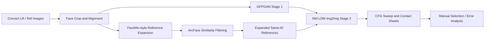
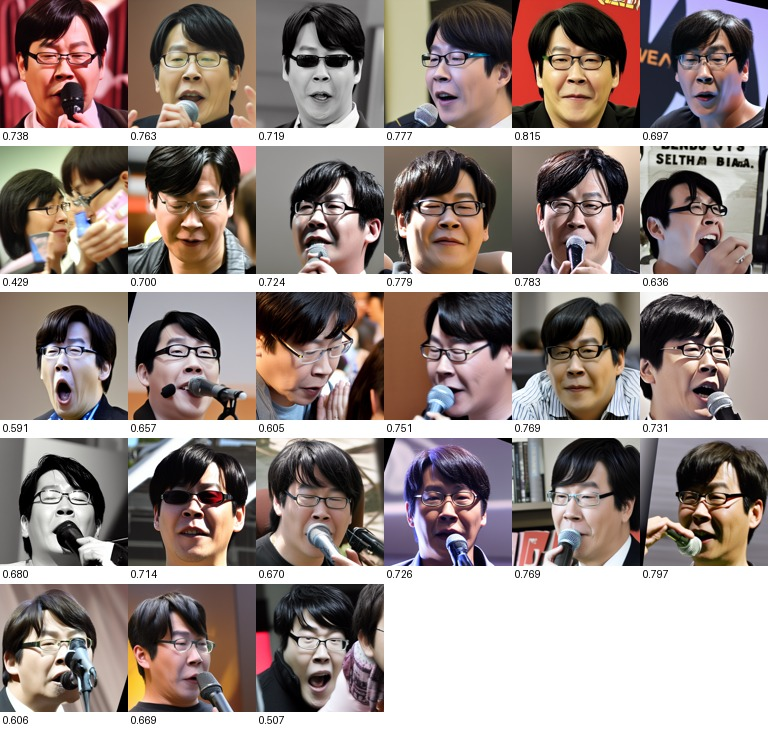
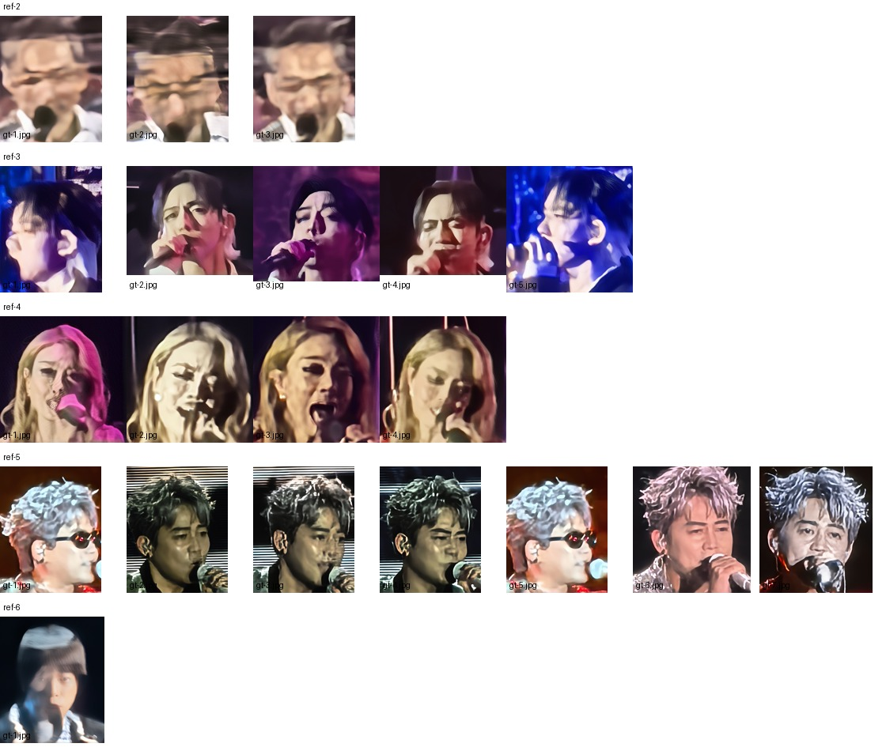
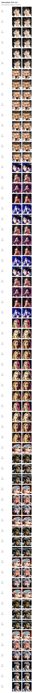

# Face Restoration with Reference Images

Reference-based blind face restoration on Huawei `concert` data. This repository is organized as a public-facing project showcase: it summarizes the motivation, technical route, experiments, engineering changes, and interview-ready takeaways of the work.

> Detailed merged report: [docs/comprehensive-report.md](docs/comprehensive-report.md)

## Project Overview

The task is to restore heavily degraded face images with the help of one or more reference images of the same identity. The `concert` dataset contains 6 identities/classes. Each identity has low-resolution or low-quality LR face inputs and reference face images. The main difficulty is that several LR inputs are extremely blurry, affected by stage lighting, occlusion, motion blur, and unstable face geometry.

This project investigated two complementary directions:

1. **Ref-LDM based reference-guided diffusion restoration**: use reference faces to guide diffusion restoration, then improve stability through preprocessing, CFG search, two-stage restoration, and img2img latent initialization.
2. **FaceMe inspired reference expansion**: generate more same-identity, multi-pose, multi-expression reference images with Arc2Face/ControlNet and ArcFace filtering, then use the expanded reference set for restoration.

## Technical Pipeline

## What I Implemented

- Built a full experiment pipeline around Ref-LDM and FaceMe on the `concert` dataset.
- Added face crop/preprocess experiments and identified that direct resizing to `512x512` can introduce face-shape distortion.
- Ran CFG-scale sweeps and analyzed the tradeoff between identity preservation and structural artifacts.
- Built a two-stage restoration route: **GFPGAN for structural recovery, Ref-LDM for reference-guided identity/detail refinement**.
- Modified Ref-LDM inference from noise-to-image toward img2img/SDEdit-style latent initialization, improving structural constraint from the LR input.
- Changed image preprocessing to aspect-ratio preserving resize plus centered padding.
- Increased Ref-LDM `max_num_refs` from 5 to 10 and tested the GPU memory boundary for larger reference counts.
- Implemented FaceMe-style reference expansion with Arc2Face + ControlNet and ArcFace similarity filtering.
- Added reference-file filtering in FaceMe inference scripts to skip metadata, control maps, and contact sheets.
- Generated per-image comparison sheets across Stage 1 and CFG 1.0 to 10.0 for faster manual evaluation.

## Key Results

| Experiment | Result |
|---|---:|
| FaceMe-generated reference images | 162 images across 6 identities |
| FaceMe restoration outputs | 22 images, matching all LR inputs |
| Ref-LDM final full run | Completed on `2026-05-19 14:11:12` |
| GFPGAN Stage 1 intermediate images | 66 |
| Ref-LDM Stage 2 CFG outputs | 660 |
| Stage comparison sheets | 66 |
| Safe reference count for batch experiments | 10 refs |
| Observed upper bound in current implementation | 13 refs pass, 14 refs OOM |

The experiments showed that the main causes of face deformation are extremely weak LR structure, direct non-square resizing, weak structure constraint in noise2img generation, unstable generated references, and mismatch between training-time and inference-time reference counts. The improved img2img route preserves LR structure better than noise2img and makes it easier to locate whether deformation comes from GFPGAN Stage 1 or Ref-LDM Stage 2.

### Result Gallery

**FaceMe-style reference expansion for one identity**

**FaceMe restoration outputs using generated references**

**Ref-LDM img2img vs noise2img at CFG 5.0**

## Code and Experiment Paths

The experimental code and generated results are kept on the `lf2` server because the full working directories include large dependencies, checkpoints, private data, and result images.

| Module | Server Path | Key Files |
|---|---|---|
| Ref-LDM experiments | `/home/hbxu/local/ref-ldm-main` | `recovered_gfpgan_two_stage_img2img/inference_two_steps_TEMPLATE.py`, `inference_two_steps_1.py` to `inference_two_steps_6.py`, `configs/refldm.yaml`, `search_cfg_scale_*.py`, `make_contact_sheet_comparison.py`, `probe_ref_oom.sh` |
| FaceMe experiments | `/home/hbxu/local/FaceMe-main` | `generate_faceme_refs.py`, `run_ref2_6_generation_and_infer.sh`, `infer_concert1.py` to `infer_concert6.py` |
| Final Ref-LDM result | `/home/hbxu/local/ref-ldm-main/results_ref1_6_generated_gfpgan_refldm_img2img_split10_aspectpad_ref10_gpu23_20260519_133740` | Stage 1, Stage 2 CFG outputs, and comparison sheets |

## Data and Model Notice

The Huawei `concert` dataset, model checkpoints, and full batch result directories are not committed to this public showcase repository. Only a few selected qualitative result figures are included for project demonstration; the README and report keep the project reproducible at the workflow level while avoiding publication of private data, model weights, or bulky experiment artifacts.

## Resume-Ready Summary

- Investigated reference-guided blind face restoration on heavily degraded concert-stage faces using Ref-LDM and FaceMe.
- Designed a two-stage GFPGAN + Ref-LDM img2img pipeline to reduce face deformation caused by extremely low-quality LR inputs.
- Built a FaceMe-style reference expansion workflow with Arc2Face/ControlNet generation and ArcFace identity filtering, producing 162 same-identity reference images for 6 identities.
- Diagnosed key failure modes including non-square resize distortion, weak noise2img structure constraints, unstable generated references, and reference-count distribution mismatch.
- Added CFG sweeps, comparison-sheet generation, reference filtering, and GPU memory-bound testing to support systematic ablation and manual selection.
