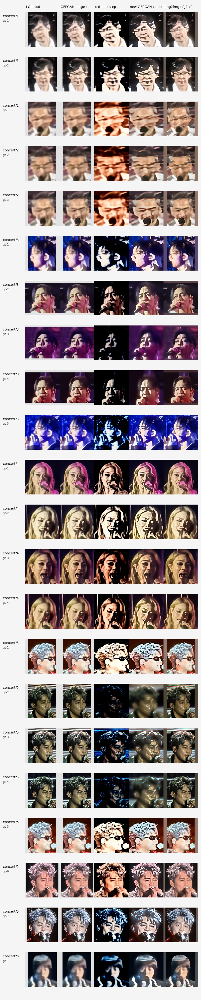
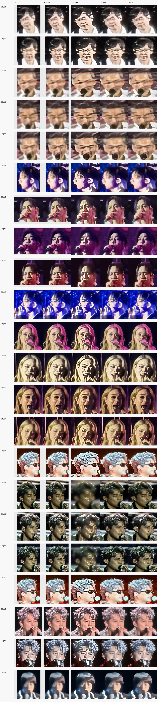

# ReF-OSEDiff One-Step vs ReF-LDM Multi-Step DDIM

This note adds the latest comparison between the original one-step ReF-OSEDiff inference route and the multi-step ReF-LDM DDIM img2img route tested as Improvement 6.

The goal was to answer a practical question:

> If one-step inference is fast but produces structural artifacts, can a very small number of DDIM denoising steps recover better face structure while keeping inference reasonably efficient?

## Compared Pipelines

### Original One-Step ReF-OSEDiff

The one-step route uses the trained ReF-OSEDiff checkpoint and runs a single restoration pass after GFPGAN preprocessing. It also includes a FaceMe-style wavelet color correction stage to reduce low-frequency color drift.

The diagnostic sheet below shows:

1. LR input.
2. GFPGAN Stage 1.
3. Original one-step output.
4. GFPGAN plus color-corrected one-step output.
5. Img2img CFG 1.0 variant.



### Improvement 6: 4-Step / 8-Step ReF-LDM DDIM Img2Img

The multi-step route keeps the same overall restoration objective but uses the original ReF-LDM DDIM sampler instead of the one-step OSEDiff sampler.

The tested pipeline was:

```text
LR input
-> GFPGAN Stage 1
-> encode GFPGAN output into VQGAN latent
-> add noise at the DDIM start timestep
-> ReF-LDM DDIM denoising with reference-image condition
-> FaceMe-style wavelet color correction
```

Two very small denoising budgets were tested:

| Mode | DDIM timesteps |
|---|---|
| DDIM-4 | `[249, 499, 749, 999]` |
| DDIM-8 | `[124, 249, 374, 499, 624, 749, 874, 999]` |

The comparison sheet below shows `LQ`, `GFPGAN`, `one-step`, `DDIM-4`, and `DDIM-8` for all 22 LR inputs from `concert/1-6`.



Raw timing records are included at:

```text
assets/results/osediff_one_step_vs_multistep/refldm_ddim4_8_timings.csv
```

## Observations

The original one-step route is fast, but it often introduces high-contrast, posterized, block-like artifacts on eyes, mouth, hair, and face boundaries. GFPGAN preprocessing and wavelet color correction improve color and global tone, but they do not remove structural artifacts created by the one-step model.

The DDIM-4 and DDIM-8 routes visibly reduce these artifacts in most examples. They preserve smoother face structure and avoid many of the black/white mask-like regions seen in the one-step output.

DDIM-8 is usually only marginally better than DDIM-4 in this experiment. The 4-step route is therefore the better current quality-speed compromise.

The script-recorded average sampler times were:

| Mode | Samples | Average recorded sampler time |
|---|---:|---:|
| DDIM-4 | 22 | 0.4188 s |
| DDIM-8 | 22 | 0.4912 s |

These timings are useful for rough comparison only. They were recorded inside the experiment script and were not synchronized with `torch.cuda.synchronize()`, so they should not be treated as final benchmark numbers.

## Important Limitation

This is not a strict same-checkpoint ablation. The one-step output comes from a trained ReF-OSEDiff checkpoint, while the multi-step output uses the original ReF-LDM checkpoint with DDIM img2img sampling.

The result still gives a clear engineering conclusion: for the current concert data, the multi-step DDIM route is more reliable for visual quality, while one-step remains the speed-oriented route that still needs better training or stronger structure constraints.

## Next Steps

1. Run a strict ablation where one-step and multi-step variants share as much training state and preprocessing as possible.
2. Add quantitative evaluation with identity similarity, LPIPS, and no-reference quality metrics.
3. Scan smaller noise strengths and step counts such as 2, 4, 6, 8, and 12 steps.
4. Re-evaluate one-step after the 20k concert-domain degradation training run is resumed and completed.
